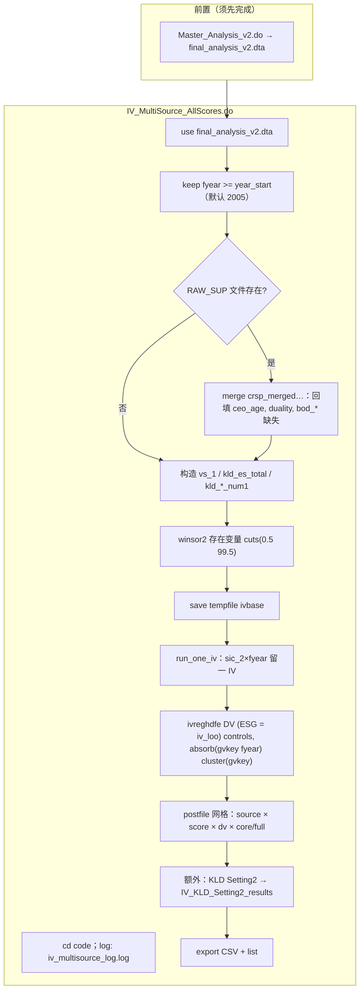

# 分析助手问答与流程图日志

本文件由助手在回答与本项目数据/代码流程相关的问题时**追加写入**；每条记录含 **ISO 风格时间戳**（本地时区）。

---

## [2026-04-06 19:09:20 +08:00] Master 主线：Legacy vs v2 定位、流程图与可调参数

### 请确认：哪两个是「主线分析」`.do`？


| 候选                | 路径                                                | 说明                                                                                  |
| ----------------- | ------------------------------------------------- | ----------------------------------------------------------------------------------- |
| **A. 归档 legacy**  | `code/legacy_corporate_esg_em/Master_Analysis.do` | 早期项目路径（`Corporate ESG and EM`、`E:\empirical_study\data_raw`、`cmm_raw.dta` 等），仅作历史对照 |
| **B. 当前目录「旧版合一」** | `code/Master_Analysis.do`                         | 与 legacy 逻辑同源，但已改为当前 `Moral Lisensing` 路径与 `data\raw` 等                             |
| **C. 最新主线 v2**    | `code/Master_Analysis_v2.do`                      | 注释写明 v2；含 **gvkey**、损耗日志、`Heese`/`Kothari`/`REM`、动态控制变量等；输出 `final_analysis_v2.dta` |


- 若目标是「legacy vs 最新」：通常选 **A + C**。
- 若目标是「同一项目内新旧两版」：通常选 **B + C**。

### 识别策略 / IV 与主线的关系

- `Identification_Strategies.do` 写明先跑 `Master_Analysis_v2.do` 生成 `$PROJ_DATA\final_analysis_v2.dta`，再做 DID、Bartik/Shift-Share IV 等。
- **IV** 主回归不在 `Master_Analysis*.do` 内，而在 `IV_MultiSource_*.do`、`SEC2010_ShiftShare_IV.do`、`Bartik_IV_Comprehensive.do` 等中。

### Mermaid：Legacy vs `Master_Analysis_v2`（左 legacy / 右 v2）

```mermaid
flowchart TB
  subgraph LEG["Legacy: legacy_corporate_esg_em/Master_Analysis.do"]
    L0["路径: 旧 ROOT / E:\\raw / cmm_raw.dta 等"]
    L1["Compustat → FF48、删金融、linkprim、缺失、小市值"]
    L2["面板: xtset cusip_n fyear"]
    L3["行业×年: keep if count ≥ 15"]
    L4["Modified Jones: asreg by SIC-2×年 + FF48×年"]
    L5["保存 dv_em_26_temp.dta"]
    L6["merge KLD/IO/MSCI/CEO 等"]
    L7["playboard → final 合并 moderators"]
    L8["reghdfe + winsor2 cuts(0.5 99.5)"]
  end

  subgraph V2["Current: Master_Analysis_v2.do"]
    V0["路径: $ROOT/data/raw|processed|output"]
    V1["Compustat → FF48、删金融、linkprim、核心变量缺失"]
    V2["gvkey 去重 gvkey×fyear"]
    V3["xtset gvkey fyear；删缺 l_at"]
    V4["行业×年: keep if ≥ 10（Heese 2023）"]
    V5["winsor2 cuts(1 99) 再估 DA"]
    V6["DA: Modified Jones + Kothari + Heese；DA+ / |DA|"]
    V7["REM: Roychowdhury；REM 相关 winsor 1–99"]
    V8["保存 dv_em_v2.dta"]
    V9["merge KLD/IO/MSCI/CEO；playboard_v2.dta"]
    V10["merge firm_age, duality → final_analysis_v2.dta"]
    V11["winsor2 cuts(0.5 99.5)；reghdfe 多组 DV/稳健性"]
    V12["ebalance 等"]
  end

  subgraph DOWN["下游（非 Master 内嵌）"]
    ID["Identification_Strategies.do：DID / RDD / Bartik IV…"]
    IVFILES["IV_MultiSource_*.do / SEC2010_* / Bartik_* 等"]
  end

  L0 --> L1 --> L2 --> L3 --> L4 --> L5 --> L6 --> L7 --> L8
  V0 --> V1 --> V2 --> V3 --> V4 --> V5 --> V6 --> V7 --> V8 --> V9 --> V10 --> V11 --> V12
  V10 --> ID
  V10 --> IVFILES

  DIFF1["差异: 单位 ID — cusip_n vs gvkey"]
  DIFF2["差异: 行业×年阈值 — ≥15 vs ≥10"]
  DIFF3["差异: v2 有样本损耗 log_sample + 去重 + Heese/REM"]
  L2 -.-> DIFF1
  V2 -.-> DIFF1
  L3 -.-> DIFF2
  V4 -.-> DIFF2
```


### 可调参数与「损耗」摘要

**Legacy / `Master_Analysis.do`（非 v2）**


| 环节         | 参数/选择                                                       |
| ---------- | ----------------------------------------------------------- |
| 样本         | 金融 SIC 6000–6999；`linkprim`；核心变量；`mv < 20`                  |
| DA 前行业×年   | `keep if count >= 15`                                       |
| 回归前 Winsor | `winsor2 ..., cuts(0.5 99.5)`；若需 **5%–95%** 改为 `cuts(5 95)` |
| `reghdfe`  | `absorb(year gvkey)`，`cluster(gvkey)`                       |


`**Master_Analysis_v2.do`**


| 环节            | 参数/选择                                                                         |
| ------------- | ----------------------------------------------------------------------------- |
| 路径            | `global ROOT` / `RAW_DATA` / `PROJ_DATA` / `OUTPUT`                           |
| 样本            | 同上 + **gvkey×fyear 去重**；**删缺 `l_at`**                                         |
| 行业×年          | `_ind_yr_n >= 10`（可改为 15 与旧版对齐）                                               |
| DA 估计前 Winsor | `cuts(1 99)`                                                                  |
| 回归前 Winsor    | `cuts(0.5 99.5)`（双侧各约 0.5%；若论文写「5% Winsor」应改为 `cuts(5 95)` 并全文一致）             |
| 控制变量          | `ctrl_core` + 动态加入（`r(N) > 5000` 门槛可调）                                        |
| `reghdfe`     | 主规格：`absorb(year gvkey)`，`cluster(gvkey)`；稳健性含 `absorb(gvkey state_n#year)` 等 |
| 中间数据          | `dv_em_v2.dta` → `playboard_v2.dta` → `final_analysis_v2.dta`                 |


**损耗**：v2 多处 `log_sample` + `display`；legacy 主要靠 merge 与 `drop`。

**待用户确认**：对照两支选 **A+C** 还是 **B+C**（或自定义路径）。

---

## [2026-04-06 19:09:20 +08:00] `IV_MultiSource_AllScores.do` 流程图及与 Master 管线对比

### 脚本角色（相对 Master）

- **不**从 Compustat 重算 DA；**输入**为 `Master_Analysis_v2.do` 产出的 `$PROJ_DATA\final_analysis_v2.dta`。
- **额外数据**：可选从 `RAW_SUP`（`crsp_merged_final_zhangyue.dta`）按 `cusip_8`×`fyear` **回填** CEO/董事会变量缺失值。
- **估计量**：`ivreghdfe` — 行业内**留一法**工具变量 `iv_loo = (sum(ESG) - ESG) / (n-1)`，按 **sic_2 × fyear** 构造（见 `run_one_iv`）。
- **吸收**：`absorb(gvkey fyear)`；**聚类**：`cluster(gvkey)`（与 Master 主规格 `absorb(year gvkey)` 等价于 firm+year FE，顺序不同）。
- **输出**：`IV_MultiSource_AllScores_results.dta` / `.csv`，及 Setting 2：`IV_KLD_Setting2_results.`*。

### 可调参数（脚本内）


| 参数                            | 位置/含义                                                                                                                                                                         |
| ----------------------------- | ----------------------------------------------------------------------------------------------------------------------------------------------------------------------------- |
| `year_start`                  | 默认 `2005`，`keep if fyear >= year_start`                                                                                                                                       |
| `RAW_SUP`                     | 外部 dta 路径；用于 backfill；文件不存在则跳过                                                                                                                                                |
| `ctrl_core` / `ctrl_full_raw` | 两套控制；full 按数据集中**实际存在**的变量子集运行                                                                                                                                                |
| `ctrl_s2`                     | Setting 2 仅用 `size mb2 lev roa`                                                                                                                                               |
| `winsor2 ... cuts(0.5 99.5)`  | 与 Master v2 回归前类似（对存在变量列表）                                                                                                                                                    |
| `dvs`                         | `ko_da_sic` `ko_da_kothari` `rem_heese`                                                                                                                                       |
| 数据源循环                         | Asset4：`vs_4` `vs_6` `vs_1`；MSCI：`environmental_pillar_score` `social_pillar_score` `weighted_average_score`；KLD：`env_kld` `emp_kld` `kld_es_total`；KLD num1：`kld_env_num1` 等 |


### Mermaid：`IV_MultiSource_AllScores.do` 单脚本流程




### 与 Master（v2）管线对比（简表）


| 维度     | Master_Analysis_v2     | IV_MultiSource_AllScores              |
| ------ | ---------------------- | ------------------------------------- |
| 起点     | 原始 Compustat           | `final_analysis_v2.dta`               |
| 核心估计   | `reghdfe` OLS          | `ivreghdfe` 2SLS（留一 IV）               |
| ESG 处理 | 作为解释变量                 | **内生**；工具变量为同行留一均值                    |
| FE     | `absorb(year gvkey)`   | `absorb(gvkey fyear)`                 |
| 聚类     | `cluster(gvkey)`       | `cluster(gvkey)`                      |
| Winsor | 全样本多阶段（含 DA 前 1–99）    | 单阶段 0.5–99.5（存在变量）                    |
| 多数据源   | 主表 MSCI/KLD 已在 merge 中 | **显式**遍历 Asset4 / MSCI / KLD 分数并排结果   |
| 额外损耗   | 全流程 attrition          | 主要 `year_start` + IV 有效样本；失败行记 `fail` |


---

*下一条记录将追加在本文件末尾，并带新时间戳。*